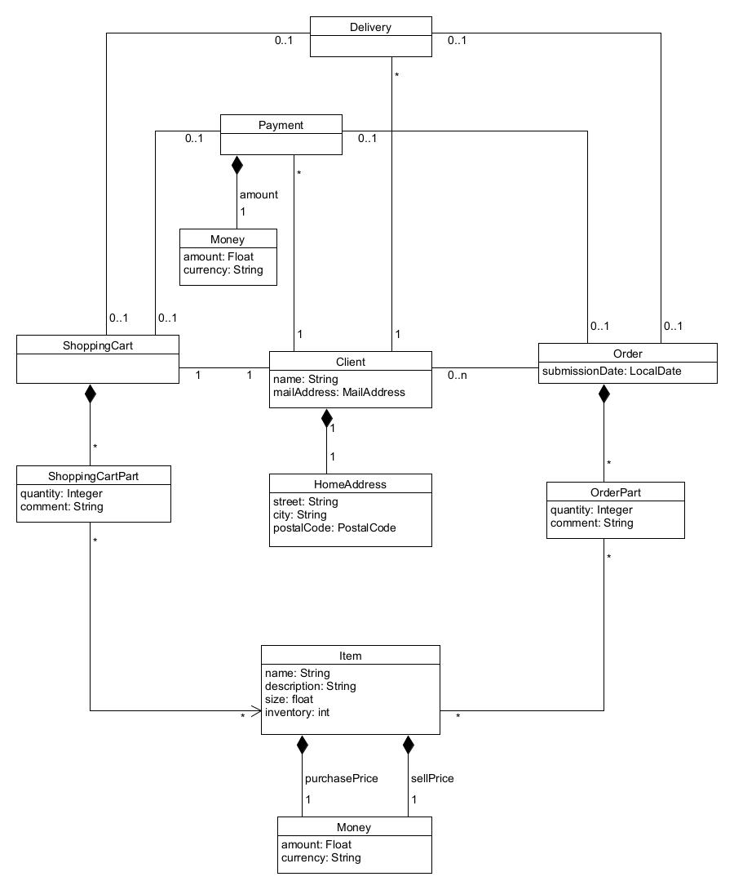

# Praktikum Softwaretechnik 2 (ST2) im SoSe 2023

Sofortiges Feedback zu Ihres Lösung finden Sie wie immer auf Ihrer 
[individuellen Testseite](http://students.pages.archi-lab.io/st2/ss23/m4/test/ST2M4_tests_group_17e20b68-b235-4f9d-bbfe-14ae6fe6b251).

# Milestone 4 (M4) - REST-Implementierung

_Da wir aus der Aufgabenbeschreibung direkt Coding-Aufgaben ableiten, ist die komplette Beschreibung in Englisch
gehalten. Wir brauchen immer mal wieder Englisch, weil fachliche Beschreibungen dazukommen. Damit nicht
ein deutsch-englisches Sprach-Mischmasch entsteht, ist ab hier alles auf Englisch._

## E1: Implement your REST API - Order Aggregate

[Level 4 (Analyse) in Bloom's Taxonomy](https://www.archi-lab.io/infopages/material/blooms_taxonomy.html#level4)

For a selected set of REST end points in our ecommerce system, you need to implement the API. To make your task 
a little easier, this as (as in milestone M3) the domain model that we assume as a base.

In order to limit your effort, you only need to implement REST endpoints for aggregates `Order` (E1) and `ShoppingCart` (E2).
For clients, items and inventory, we assume that there is already master data in the system that (for now) 
is not changed by the REST API.

### Your Task in E1

Implement the following REST endpoints. We assume that the returned data is in JSON format.

| Requirement                                                                    | Verb  | URI                                           | 
|--------------------------------------------------------------------------------|-------|-----------------------------------------------|
| (1) Find all orders for client with `mailAddressId`, ordered by time | GET   | /orders?mailAddress=...               |
| (2) Find the latest order for client with `mailAddressId`            | GET   | /orders?mailAddress=...&filter=latest |

The returned data in (1) and (2) needs to be an array of orders. If mailAddress is not found, or has no orders, 
then an empty array is returned.

Each order must contain:
- The `id` of the order 
- The `mailAddress` of that client (as an `MailAddress` object - we assume that the nested property
  is called `mailAddressString`)
- The total `price` of the order as a `Money` object
- `orderParts` as an array of order parts

Each order part within the order must contain:
- The `itemId` of the item purchased in this order part
- The `quantity` 
- The `comment` (if any) for this order part

## E2: Implement your REST API - ShoppingCart Aggregate

[Level 4 (Analyse) in Bloom's Taxonomy](https://www.archi-lab.io/infopages/material/blooms_taxonomy.html#level4)

Same as for order, you need to implement the following REST endpoints for the shopping cart aggregate.

| Requirement                                                                     | Verb   | URI                                                                    | 
|---------------------------------------------------------------------------------|--------|------------------------------------------------------------------------|
| (1) Return the shopping cart for a specific client with `mailAddress`      | GET    | /shoppingCarts?mailAddress=...                                  |   
| (2) For a specific shopping cart, add/remove a certain quantity of items         | POST   | /shoppingCarts/{shoppingCart-id}/shoppingCartParts                |
| (3) For a specific shopping cart, delete the shopping cart part for this item | DELETE | /shoppingCarts/{shoppingCart-id}/shoppingCartParts/{item-id} |
| (4) For a specific shopping cart and item, get quantity and comment              | GET    | /shoppingCarts/{shoppingCart-id}/shoppingCartParts/{item-id} |
| (5) Check out a shopping cart                                                        | PUT    | /shoppingCarts/{shoppingCart-id}/checkout                                  |    

To work with shopping carts, you need to know the `shoppingCartId` of the shopping cart for a specific client.
This, you can find out using (1). The returned data is a JSON object with the following properties:
- `id` of the shopping cart
- `mailAddress` of that client (as an `MailAddress` object - we assume that the nested property
  is called `mailAddressString`)
- the `totalQuantity` of all items combined in the shopping cart

As there can only be one shopping cart per client, the returned data is either a JSON object with the above properties,
if the mail address exists in the system, or error 404 if it does not exist. 

The shopping cart parts do NOT need to be contained in this JSON object. Instead, they are
managed separately using (2-4).
- Adding / removing a quantity of items to a shopping cart works by sending a POST request (2) containing
  a request body with the following properties. If the item is already in the shopping cart, then the 
  quantity is added to / removed from the existing quantity. Otherwise, a new shopping cart part for 
  that item is created.
  - `itemId` of the item to be added
  - `quantity` of items to be added (if positive) or removed (if negative)
  - `comment` (if any) for this part (this will replace any existing comment)
- If the item should be removed entirely from the shopping cart, then use a DELETE request (3). (This must
  have the same effect as setting the quantity to 0, or removing quantity so that only 0 is left.
  In all three cases, the items should not be present in the shopping cart anymore, i.e. a GET query
  leads to a 404 error.)
- Querying the quantity and comment for a specific item in a shopping cart works by sending a 
  GET request (4) to the URI of the shopping cart part. It should return a JSON object with the 
  same properties as in (2) - (3).

The checkout of a shopping cart (6) works as described in milestone M3, with the same limits (20 pieces, 500€ max).

### Additional Hints for E1 and E2

Please use the following HTTP response codes for your REST API:
- `201 Created` for successfully creating something new
- `200 OK` for any other successful operation
- `404 Not Found` if a resource does not exist
- `409 Conflict` executing this operation would cause a conflict on server side, e.g. by violating a business rule
- `422 Unprocessable Entity` if the request is syntactically correct, but semantically wrong, e.g. by 
   submitting invalid data.

## E3: Code Rules (Clean Code and SOLID Principles, No Cyclic Dependencies, DDD Rules)

[Level 5 (Evaluate) in Bloom's Taxonomy](https://www.archi-lab.io/infopages/material/blooms_taxonomy.html#level5)

You need to continue applying the Clean Code rules and the SOLID principles. We will check the following aspects:

* Clean Code
    * Meaningful names for variables, classes, packages, ...
    * Methods should be small, not longer than max. 30 lines of code, and if possible should be much smaller.
    * Code lines should not extend 120 characters - add a linebreak otherwise, or try re-writing the code.
* SOLID
    * Single Responsibility Principle
        * Classes should serve one purpose only
        * No domain business logic in application services or controllers
    * Open-Closed Principle
        * No public access to member variables
        * States (see above for ShoppingCart) must be encapsulated - no possibility of directly changing the status from outside
    * Dependency Inversion Principle
        * No cyclic dependencies - avoid them by applying the DIP

There is also a no-cycle-test, and some other DDD rule tests. 

## E4: Code Review - Manual Tests

[Level 5 (Evaluate) in Bloom's Taxonomy](https://www.archi-lab.io/infopages/material/blooms_taxonomy.html#level5)

In addition we will check your code manually. Manual tests will be performed by 
looking at samples (Stichproben) of the students' solutions. Therefore, the manual
tests for E4 will all be initially green. If we pick your solution for a manual check, and we find violations, then
it will turn red. You will see the feedback in error message. We will not perform a thorough code review, but
check certain critical aspects of your code.

### Your Task in E4

* Resolve cyclic dependencies in your code, using the Dependency Inversion Principle (DIP). 
* Apply the Clean Code rules and the SOLID principles. 
* Fix issues we give you in the manual review.

## Additional Help for Clean Code and SOLID

- Some of the automated tests are based on the PMD Source Code Analyzer, which runs in our pipeline (so you
  don't have this locally). If you want to learn more about each test, feel free to check the
  documentation at [pmd.github.io](https://pmd.github.io/latest/pmd_rules_java.html).
- Although PMD is not available as a local unit test, there is an IntelliJ plugin that you can use to 
  run the PMD ruleset locally. More infos how to install and use it on our ArchiLab infopage:
  [https://www.archi-lab.io/pmd](https://www.archi-lab.io/pmd).
- For our subjective selection of Clean Code and SOLID principles, see our ArchiLab infopage
  [https://www.archi-lab.io/cc-solid](https://www.archi-lab.io/cc-solid).

